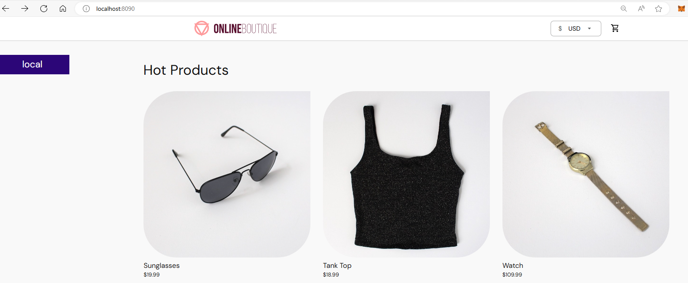
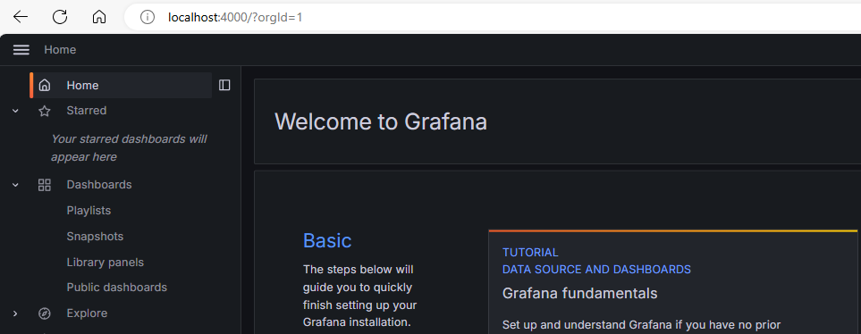
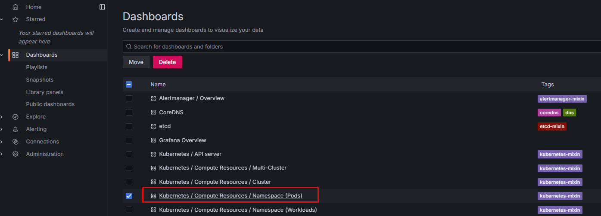
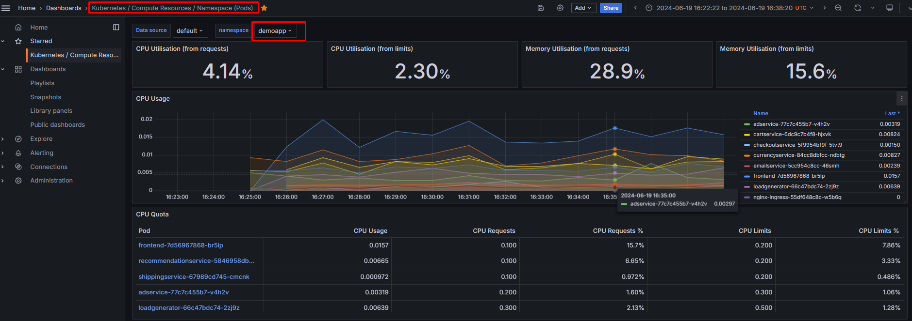

# microservices-deployment

Sample microservices deployment on k8s with reverse proxy, monitoring, logging features...

## Introduction

In this project you'll use following tools and applications:

- K8s
- Helm
- Prometheus + Grafana
- Nginx
- 10+ microservices
- K8s dashboard

Now let's start the journey!

## 1. Deploy the namespace

```bash
# monitor
kubectl create ns monitoring
# app
kubectl create ns demoapp

# Check namespaces
kubectl get ns
```

## 2. Deploy K8s dashboard

- Docs:

  - https://kubernetes.io/docs/tasks/access-application-cluster/web-ui-dashboard/
  - https://github.com/kubernetes/dashboard/blob/master/docs/user/access-control/creating-sample-user.md

- Deploy dashboard

```bash
kubectl apply -f https://raw.githubusercontent.com/kubernetes/dashboard/v2.7.0/aio/deploy/recommended.yaml

# Check/Verify
kubectl get all -n kubernetes-dashboard
```

- Forward port so we can access the dashboard

```bash
# Note: You can also replace 8443 to the working PORT in your PC
kubectl port-forward service/kubernetes-dashboard -n kubernetes-dashboard 8443:443
```

- Create admin user

```bash
kubectl apply -f manifest/k8s-dashboard-user/admin.yaml
```

- Access the dashboard at: https://localhost:8443/, then you can use token to login to dashboard
- You can get the token to access dashboard via: `kubectl get secret admin-user -n kubernetes-dashboard -o jsonpath={".data.token"} | base64 -d`

## 3. Deploy the application

In this project we use the sample microservices application from [GoogleCloudPlatform/microservices-demo](https://github.com/GoogleCloudPlatform/microservices-demo)

```bash
kubectl apply -f https://raw.githubusercontent.com/GoogleCloudPlatform/microservices-demo/main/release/kubernetes-manifests.yaml -n demoapp
# To debug, run: kubectl get services -n  demoapp
```

## 4. Deploy Nginx proxy

Deploy the Nginx proxy prior to `fontend` service, using [manifest/nginx](./manifest/nginx/nginx.yaml)

```bash
kubectl apply -f manifest/nginx/nginx.yaml -n demoapp
# To debug, run: kubectl get services -n  demoapp
```

## 5. Expose Nginx service

Open another terminal and run:

```bash
# Note: You can also replace 8090 to the working PORT in your PC
kubectl port-forward service/nginx-ingress -n demoapp 8090:80
```

Now visit http://localhost:8090/ to access your application locally:



## 6. Prometheus + Grafana

In section #4 we've successfully deploy our microservices application on k8s, deploy the Nginx proxy infont of the fontend app. Now let's monitor our application with Prometheus + Grafana

### 6.1. Deploy Prometheus/Grafana stack

<!--  -->

- We will use Helm to deploy the Prometheus stack from `prometheus-community`:

```bash
# Prepare
helm repo add prometheus-community https://prometheus-community.github.io/helm-charts
helm repo update
# Deploy
helm install kube-prometheus-stack prometheus-community/kube-prometheus-stack --namespace monitoring
```

- Verify installation

```bash
# Pod checking
kubectl --namespace monitoring get pods -l "release=kube-prometheus-stack"
# All resources checking
kubectl --namespace monitoring get all
```

### 6.2. Access the dashboard

- Expose Grafana

```bash
kubectl port-forward svc/kube-prometheus-stack-grafana -n monitoring 4000:80
```

- Expose Prometheus

```bash
kubectl port-forward svc/kube-prometheus-stack-prometheus -n monitoring 4001:9090
```

- Now we can login to http://localhost:4000 (The default username/password for Grafana is `admin/prom-operator`)
  

### 6.3. Explore the Grafana

- Choose your dashboard
  

- Select the namespace
  

- Keep exploring the dashboard your way to see the metrics stats of our application on Kubernetes

## 7. Check K8s dashboard

- Visit the k8s dashboard (https://localhost:8443/), login and choose the `demoapp` namespace, you can see the workload and k8s object (deployment, pod, sevice, ...) statuses:
  

## Cleanup!
In case you want to cleanup the resources:
```bash
# Cleanup application
kubectl delete namespace demoapp

# Cleanup other namespace
kubectl delete namespace <namespace_name>
```

## Reference

- https://artifacthub.io
- https://prometheus-community.github.io/helm-charts
- https://helm.sh/docs/
- https://github.com/GoogleCloudPlatform/microservices-demo
- https://nginx.org/en/docs/
